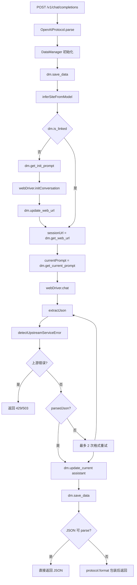

# 控制模块（`controller`）

## 1. 模块职责

控制模块是 WebClawProxy 的 HTTP 编排层，负责把一次 OpenAI 风格请求串联成完整流程：

1. 协议解析（OpenAI → 内部统一结构）
2. 数据落盘与会话映射（DataManager）
3. 网页模型交互（WebDriverManager）
4. 结果标准化返回（JSON 直返或 OpenAI 包装）

主要文件：

- `src/controller/index.ts`：服务启动入口
- `src/controller/server.ts`：Express 应用与中间件
- `src/controller/routes/openai.ts`：核心路由逻辑

---

## 2. 对外接口

## 2.1 `POST /v1/chat/completions`

兼容 OpenAI Chat Completions 请求格式。

典型请求：

```json
{
  "model": "deepseek-chat",
  "messages": [
    { "role": "system", "content": "你是一个助手" },
    { "role": "user", "content": "你好" }
  ],
  "tools": [],
  "stream": false
}
```

典型成功响应：

- 控制层统一使用 `protocol.format()` 返回 OpenAI 风格结构
- 当网页模型返回 JSON/JSONC 时，会提取其中 `message.content/tool_calls/finish_reason` 再进行标准化包装

## 2.2 `GET /v1/models`

从 `config/default.json` 的 `models` 汇总模型列表，返回 OpenAI 风格 `list` 结构。

## 2.3 `GET /health`

返回 `{ status: 'ok', timestamp }`。

---

## 3. 中间件与基础行为

实现文件：`src/controller/server.ts`

- `express.json({ limit: '10mb' })`
- URL 编码解析
- 请求日志（方法 + 路径）
- CORS（`*`）
- `OPTIONS *` 预检
- 404 统一 JSON
- 全局 500 错误处理

---

## 4. `chatCompletionsHandler` 处理链路（当前真实实现）

实现文件：`src/controller/routes/openai.ts`

### 流程图



### Step 1：协议解析

- 调用 `OpenAIProtocol.parse(req.body)` 得到 `internalReq`
- 解析失败（`ProtocolParseError`）返回 `400 invalid_request_error`

### Step 2：初始化 DataManager

- `const dm = new DataManager(internalReq)`

### Step 3：保存数据

- `await dm.save_data()`

### Step 4：模型→站点映射

通过 `inferSiteFromModel(model)` 推断 `SiteKey`：`gpt | qwen | deepseek | kimi`

### Step 5：会话链接判定与上下文额度切换

- `!dm.is_linked()`：
  - 生成 `initPrompt = dm.get_init_prompt()`
  - `webDriver.initConversation(site, initPrompt)`
  - `dm.update_web_url(sessionUrl)`
- 已链接：`sessionUrl = dm.get_web_url()`
- 若已链接且启用 `context_switch`，并且 `dm.get_usage().usage` 超过阈值：
  - 再次 `webDriver.initConversation(site, initPrompt)`
  - `dm.update_web_url(newSessionUrl)` 追加新会话 URL
  - 当前请求使用新 URL 继续发送

### Step 6：发送当前消息

- `currentPrompt = dm.get_current_prompt()`
- `chatResult = webDriver.chat(site, sessionUrl, currentPrompt)`

### Step 7：响应解析与重试（关键）

控制层会按以下策略处理 `chatResult.content`：

1. `extractJson(responseContent)` 解析 JSON
   - 支持普通 JSON
   - 支持 markdown code fence（```json / ```jsonc）
   - 支持 JSONC 容错：行/块注释、末尾逗号
2. `detectUpstreamServiceError(responseContent)` 识别上游错误文本
   - 额度/限流类 → `429 rate_limit_error`
   - 服务繁忙/不可用类 → `503 service_unavailable`
3. 若既不是 JSON 也不是上游错误，则最多重试 2 次：
   - 发送 `dm.get_format_only_retry_prompt()`（仅格式提醒模板，不拼接原问题）

### Step 8：落盘 assistant 消息

- `dm.update_current({ role: 'assistant', content: parsedJson ?? responseContent })`
- `await dm.save_data()`

### Step 9：返回客户端

- 若 `parsedJson` 可被 `JSON.parse`：直接 `res.json(jsonResponse)`
- 否则：`protocol.format({ content, model })`

---

## 5. 错误映射（HTTP）

| 场景 | 返回码 | type | code |
|---|---:|---|---|
| 协议格式错误 | 400 | `invalid_request_error` | `invalid_request` |
| 未登录网页端 | 401 | `authentication_error` | `not_logged_in` |
| session URL 失效 | 422 | `invalid_request_error` | `invalid_session_url` |
| 模型响应超时 | 408 | `timeout_error` | `response_timeout` |
| 上游额度上限/限流 | 429 | `rate_limit_error` | `quota_exceeded` |
| 上游服务繁忙/不可用 | 503 | `service_unavailable` | `upstream_service_error` |
| 未捕获异常 | 500 | `server_error` | `internal_error` |

---

## 6. 配置与启动

- 端口优先级：`process.env.PORT` > `config.server.port` > `3000`
- 支持上下文额度触发切换（`config.context_switch`）：
  - `enabled`：是否启用
  - `max_prompt_tokens`：prompt 阈值（达到即切换）
  - `max_total_tokens`：total 阈值（达到即切换）
- 启动入口：`src/controller/index.ts`

```bash
npm run dev
# 或
npm run build && npm start
```

---

## 7. 与其他模块依赖关系

- 依赖 `protocol`：请求解析与响应包装
- 依赖 `data-manager`：会话映射、状态持久化、prompt 构造
- 依赖 `web-driver`：真实网页模型交互

`controller` 不直接处理站点 DOM，站点差异由 `web-driver/drivers/*` 吸收。

---

## 8. 测试覆盖

测试文件：`tests/controller/server.test.ts`

已覆盖关键路径：

- `GET /health`
- `GET /v1/models`
- `POST /v1/chat/completions` 成功路径
- 协议错误（400）
- JSONC 回复正确识别且不重试
- 上游额度错误（429）
- 上游服务繁忙（503）
- 未知路由（404）

运行：

```bash
npm run test:controller
```
